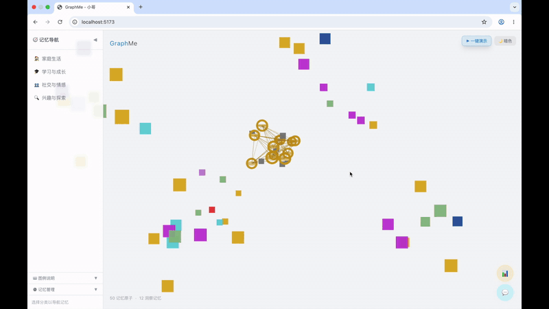

# GraphMe（小哥）— 记忆星云可视化系统



> **记忆不是孤岛，而是星座——让每一颗记忆原子在时空中相互关联，照亮那些深埋已久的高价值时刻。**

**[📺 观看完整 Demo Video](https://1drv.ms/v/c/203d7a34c28a5187/IQDbJB1z5tGgSpcGYpKGmnT0ARx1Wk9lUe0VOfBePv6BUvw?e=AfcGCF)**

---

## 为什么要做 GraphMe？

AI 正以前所未有的速度渗透到我们的日常生活——智能音箱记得你的音乐偏好，陪伴机器人知道你孩子的名字，学习助手了解你的知识盲区。但这些 AI agent 记住的东西，对用户来说始终是一个**黑盒**。

你不知道 agent 记住了什么、不知道它为什么会做出某个回应、不知道哪些记忆该留着、哪些该删掉。更糟的是，不同 agent 应用之间的记忆是天然隔离的——你的陪伴机器人和学习助手各自存储了关于你的碎片，却从未被整合成一幅完整的"你"的画像。

**GraphMe 想解决的核心问题：把 AI agent 的"记忆黑盒"打开，变成用户可感知、可探索、可管理的数字记忆资产。**

---

## 核心思路

GraphMe 的名字来源于 **Graph（图谱）+ Me（我）**——你的记忆不是散落的点，而是相互关联的认知网络。

### 双层记忆架构

GraphMe 将记忆分为两个层次：

| | 原始记忆（Raw Memory） | 洞察记忆（Insight Memory） |
|---|---|---|
| **是什么** | 用户直接输入或系统自动记录的事件 | 从原始记忆聚类推理生成的高阶认知 |
| **好比** | "发生过的事" | "被发现的模式 / 趋势 / 信念" |
| **性质** | 事实性的，不可推翻 | 概率性的，随新数据演进 |
| **操作** | 只能被删除 | 只能被新版本替代（旧版本保留为历史） |

当新的原始记忆加入时，系统会重新推理并生成新版本的洞察记忆——这正是心理学中**巴特莱特的"图式"理论**和**皮亚杰的"同化与顺应"**在数字记忆领域的映射：人的记忆不是简单回放，而是用已有心理框架不断重构。GraphMe 让这个动态过程变得可见。

### 从向量空间到 3D 记忆星云

AI 的记忆天然存在于多维向量空间中。GraphMe 不做炫技的视觉效果，而是让你直观感受到向量空间中那些天然存在的关系：

- **语义距离（Semantic Distance）→ 粒子的远与近**——越相关的记忆越靠近
- **聚类（Clustering）→ 簇群的形成与重叠**——相似记忆自动聚集成簇
- **分类（Classification）→ 粒子的颜色与归类**——不同类别的记忆用颜色区分

你拖拽、旋转、缩放这个 3D 记忆星云时，操控的不只是视觉效果，而是对向量空间关系的物理直觉。

---

## 这个项目是怎么做出来的？Stitch design + Trae IDE + DeepSeek model

---

## 快速开始

### 前置要求

- Node.js >= 18
- npm >= 9

### 安装与运行

```bash
git clone https://github.com/wukun2005-gif/GraphMe.git
cd GraphMe
npm install
npm run dev
```

浏览器打开 `http://localhost:5173` 即可看到 3D 记忆星云。

---

## License

MIT